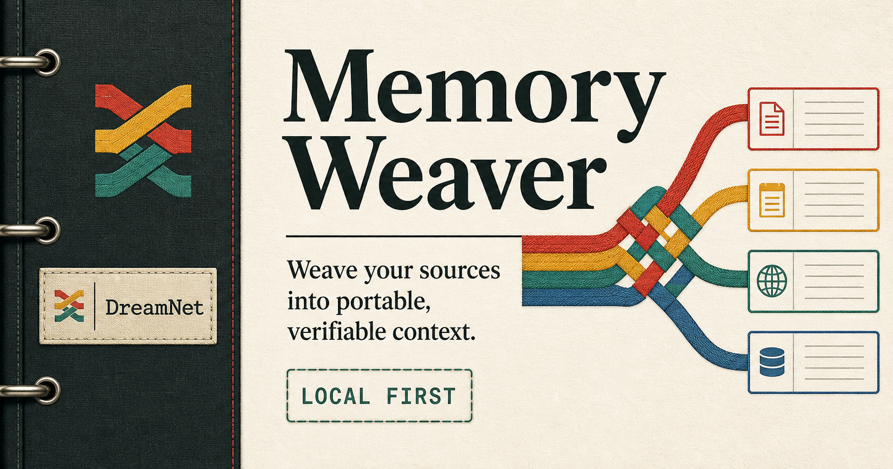

# Memory Weaver



Memory Weaver turns user-owned documents, repositories, conversations, and exports into a portable knowledge weave with source provenance, relationship threads, maintenance findings, and deterministic receipts.

It is the local-first knowledge preparation layer for [Warper Keeper](https://github.com/BrandonDucar) and the broader DreamNet public toolchain. It also works as a standalone application.

## What works today

- Populated product demo that shows a finished weave
- Local Markdown, text, CSV, and JSON ingestion
- Public and private GitHub repository import from the browser
- Deterministic topic and relationship extraction
- Duplicate, stale, orphan, and contradiction checks
- Searchable source vault with provenance
- Local receipt ledger with stable input and output hashes
- Portable `.weave.json`, `capsule.md`, and `trapper.json` exports
- Optional OpenAI-compatible endpoint connection check
- Installable web-app manifest and offline shell
- No account, hosted database, or DreamNet backend required
- Permissioned local companion with encrypted PGLite storage
- KoiDream provenance, versioning, deduplication, and receipt generation
- Gourami topology weaving across approved local sources
- Loopback-free local MCP server over stdio
- Passive Memory Cartographer with a 30+ source catalog and approval cards
- Deterministic Steward morning, daily, and weekly briefs
- First-run Initial Analysis with source coverage, themes, dormant material, and Memory Shadows
- Whole-file inventory with content extraction where safe and metadata-only coverage elsewhere
- Read-only Gmail backfill and local EML ingestion
- Photo, video, and audio resurfacing metadata without copying or editing originals

## Privacy boundary

The browser release stores workspaces in browser storage. Files are processed in the browser. GitHub and model credentials are held in component memory for the active tab and are sent only to the endpoint the user chooses.

The local companion keeps approved source bodies and Steward briefs in an AES-256-GCM encrypted PGLite vault, watches only approved roots, and exposes only explicitly MCP-enabled sources over local stdio. The Cartographer may detect that a source exists, but it cannot grant itself permission to ingest it. Secret-bearing files are represented by metadata rather than copied content. It does not claim zero-knowledge processing or hosted OAuth. OS-keychain credential references and signed desktop installers remain future hardening work.

## KoiDream + Gourami

Memory Weaver is the hybrid of two DreamNet fish roles:

```text
KoiDream: continuity, provenance, versions, receipts
                     +
Gourami: topology, relationships, routing, shared context
                     =
Memory Weaver: a user-owned memory mesh across approved apps and agents
```

The local companion is in [`desktop/`](desktop/README.md). It starts with no connectors and no permissions.

[Download the local companion alpha](https://github.com/BrandonDucar/memory-weaver/releases/tag/memory-weaver-local-v0.1.0-alpha.2)

## Product contract

```text
Selected sources
→ secret redaction
→ deterministic normalization
→ topic and relationship weave
→ friction checks
→ local receipt
→ Capsule / Trapper / archive export
```

DreamLoops define bounded behavior. Capsules carry reusable capability. Trappers carry working context. Memory Weaver prepares and verifies the context those objects can transport.

## Development

Requires Node.js 22.13 or newer.

```bash
npm install
npm run dev
```

Verification:

```bash
npx tsc --noEmit
npm run lint
npm test
npm audit
```

## Current status

Public alpha. The deterministic browser engine, exports, and encrypted local companion are usable now. Hosted collaboration, OS-keychain integration, and cloud acceleration are deliberately not part of this release. Source connectors are permanently read-only.

## Roadmap

1. Native Redis, NATS, Kafka, Neon, Graphiti, Drive, Slack, Notion, Discord, and Telegram drivers
2. OS-keychain credentials and signed desktop installers
3. Read-only Notion, Drive, Slack, Discord, and Telegram adapters
4. Warper Keeper Source Bridge import/export
5. Local Ollama enrichment through the Agent Gateway
6. Optional Graphiti projection without moving source bodies

## License

Apache License 2.0. See [LICENSE](LICENSE).
